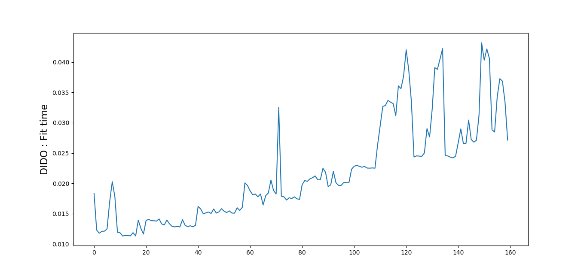
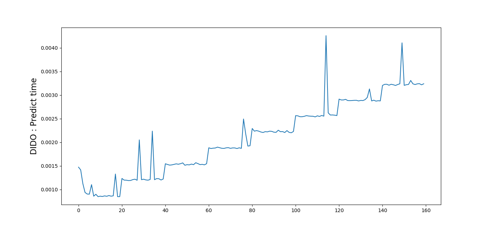
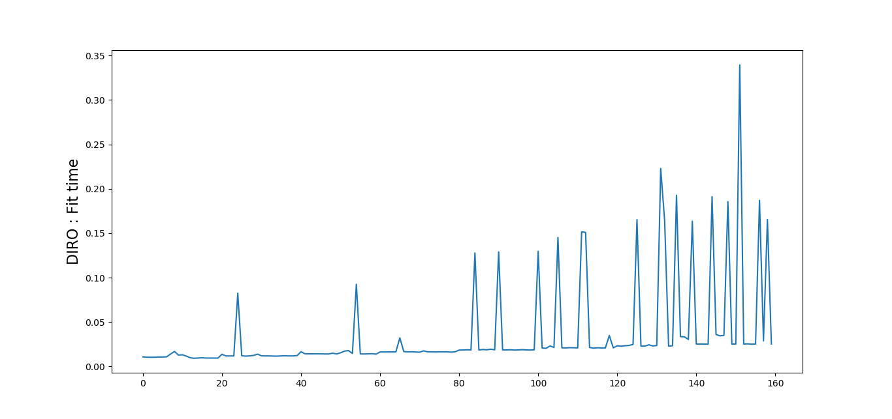
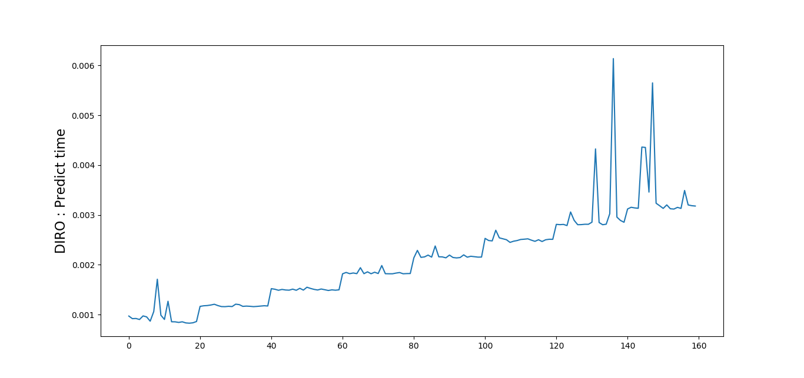
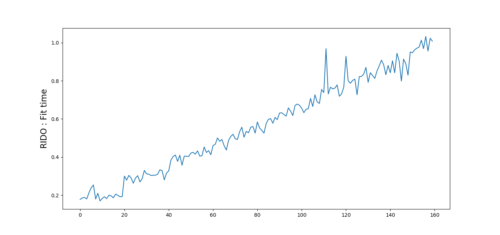
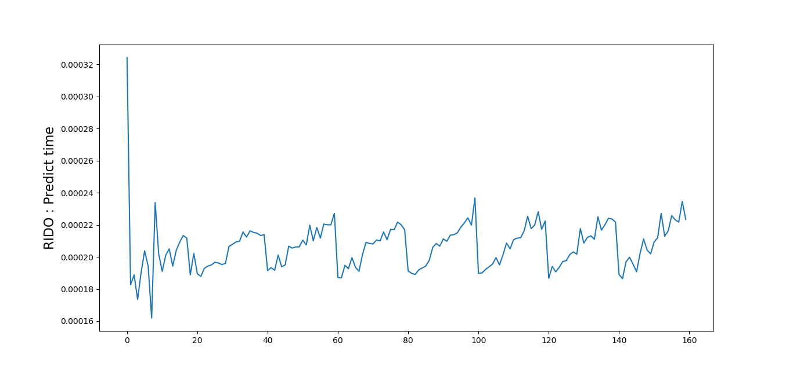
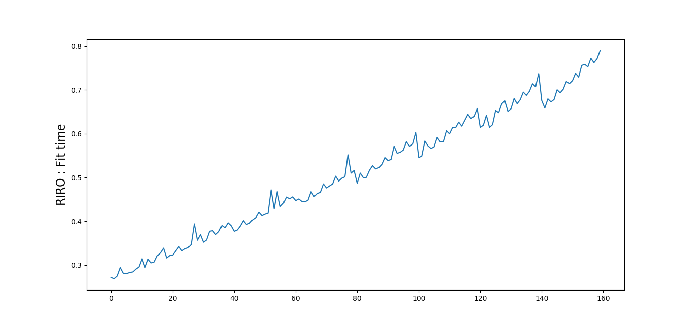
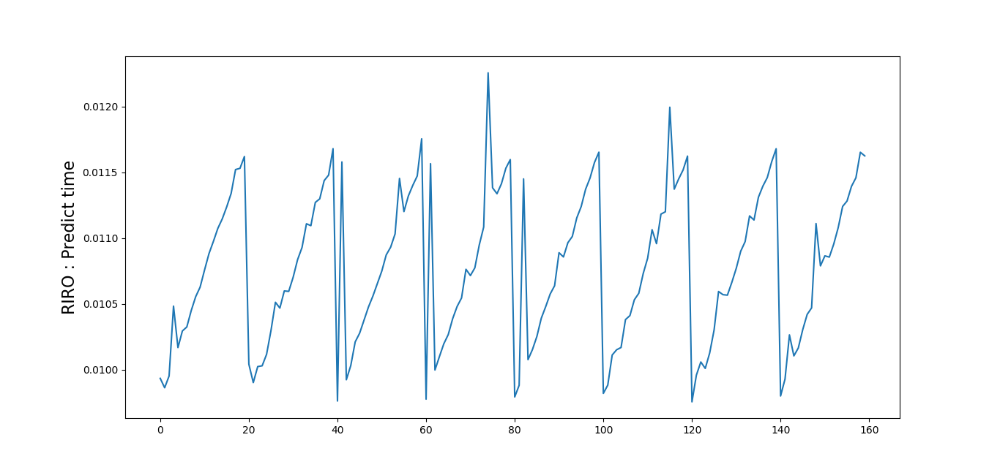

# ES654-2020 Assignment 1

*Rohit Shantaram Patil* - *17110126*

------

> Write the answers for the subjective questions here
##  RESULTS

### Real_Estate_data:
proposed model:
RMSE 10.514454230616812
MAE 7.768235438790656

Scikit-learn model:
RMSE 6.009124087591241 
MAE 5.965485335760335

### IRIS Data
#### Unshuffled 70-30 split:

Accuracy 0.6666666666666666
Precision: for class  2  :  1.0
Recall:  2  :  0.6666666666666666

#### 5-fold Cross Validation
AVG accuracy is 0.70

#### Nested-Cross Validation

Accuracy is, 0.9666666666666667  for iteration 1 . The depth of the optimal tree is  5
Accuracy is, 0.6666666666666666  for iteration 2 . The depth of the optimal tree is  8
Accuracy is, 0.8333333333333334  for iteration 3 . The depth of the optimal tree is  8
Accuracy is, 0.2  for iteration 4 . The depth of the optimal tree is  7
Accuracy is, 0.6666666666666666  for iteration 5 . The depth of the optimal tree is  7 

## Graphs and Analysis

## Theoretical time complexity for training is O(mnlog(n))
## Prediction time complexity is O(log(n)s)

## DISCRETE INPUT DISCRETE OUTPUT

## DISCRETE INPUT REAL OUTPUT

## REAL INPUT DISCRETE OUTPUT
### Observed time required for training (RIDO) is greater than that of others.

## REAL INPUT REAL OUTPUT

