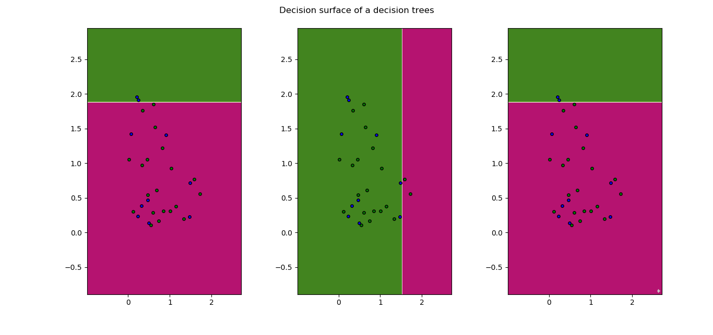
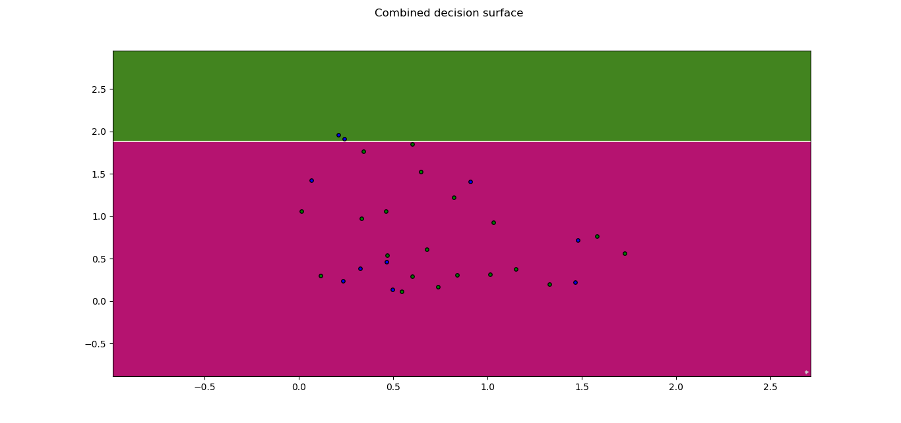
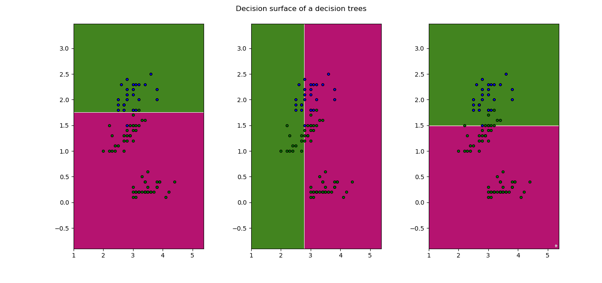
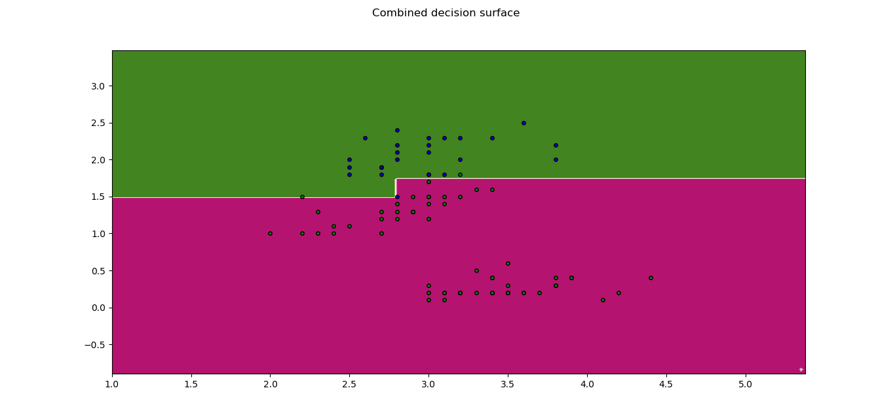

# ES654-2020 Assignment 2

*Rohit Shantaram Patil* - *17110126*
------

> Write the answers for the subjective questions here
## (a) Adaboost on Real Input Discrete output

Accuracy:  0.7333333333333333
Precision for 1  :  1.0
Recall for  1 :  0.2
Precision for 0  :  0.7142857142857143
Recall for  0 :  1

### plots

## (b) Adaboost on Iris Dataset

0.9666666666666667
Precision for 0  :  0.9743589743589743
Recall for  0 :  0.9743589743589743
Precision for 1  :  0.9523809523809523
Recall for  1 :  1

Accuracy for Decision Stump over Iris Dataser : 0.95
### plots

