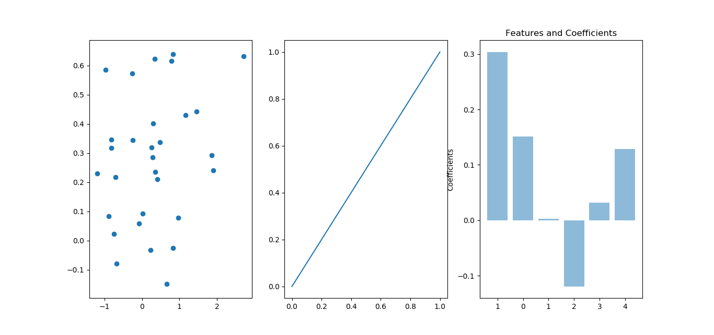
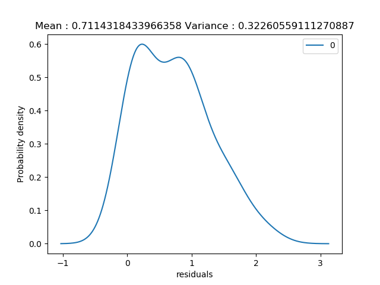
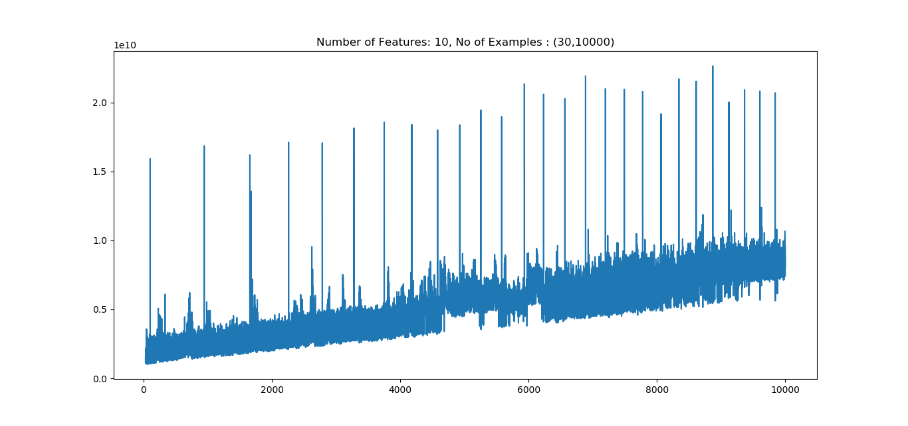
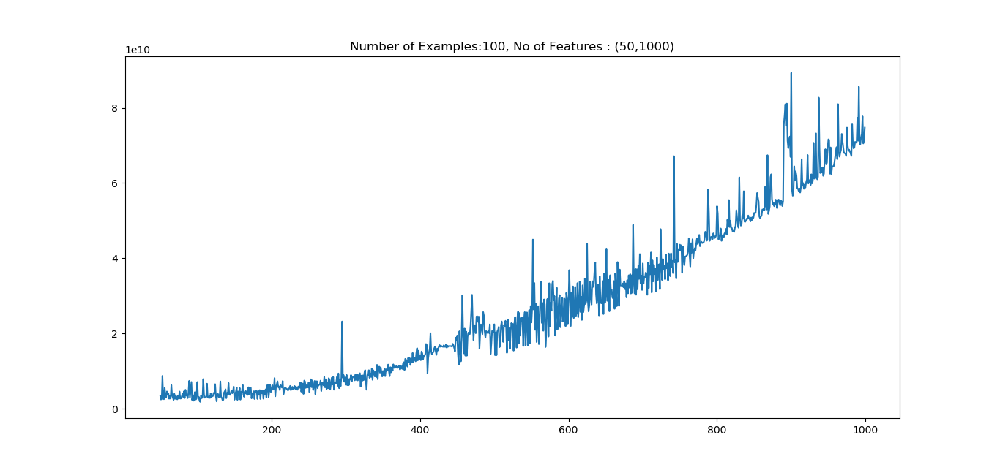

# ES654-2020 Assignment 2

*Rohit Shantaram Patil* - *17110126*
------

> Write the answers for the subjective questions here

## (a)Linear Regression on random data:
### fit_intercept = True
RMSE:  0.9044265250464998
MAE:  0.7114318433966358

### fit_intercept = False
RMSE:  0.9452375875781542
MAE:  0.7590075233630846

### plots

## (b) Time Complexity
Theoretical time complexity of linear regression using Normal equation is:
N^2*P + P^3
Where N is the number of examples and P is the number of features

### Time complexity Plots
P fixed , N variable

N fixed, P variable

Here, we observe that time complexity for the second graph increases rapidly as compared to the first graph. That's in accordance with the theoretical results

## (c) Real Estate Data
MAE and STDDEV for  1 th fold  are  5.488911690270041 4.504622339586972

MAE and STDDEV for  2 th fold  are  6.785414600252191 6.4180490026086

MAE and STDDEV for  3 th fold  are  5.2659302887267625 5.549960003770137

MAE and STDDEV for  4 th fold  are  7.314569401011414 9.040542396755685

MAE and STDDEV for  5 th fold  are  5.955763551058159 5.036180611112965

Average MAE and STDDEV are  6.162117906263714 6.109870870766871