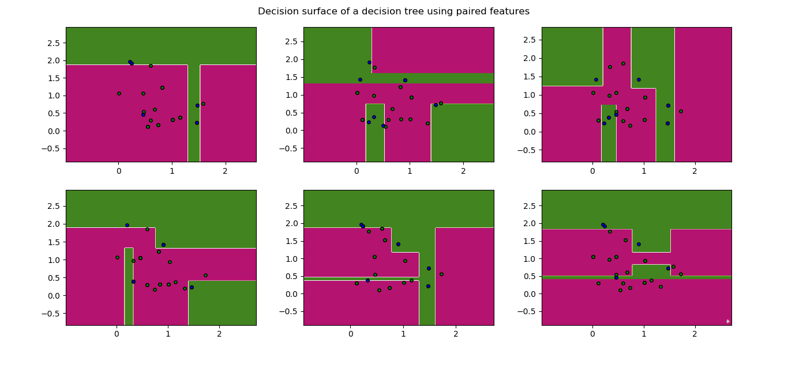
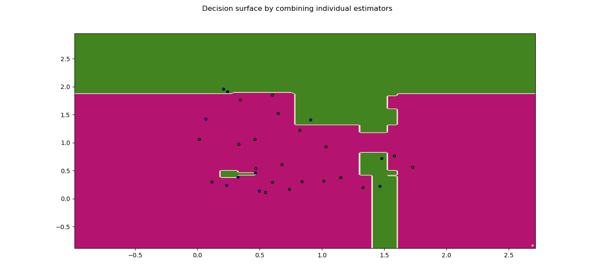
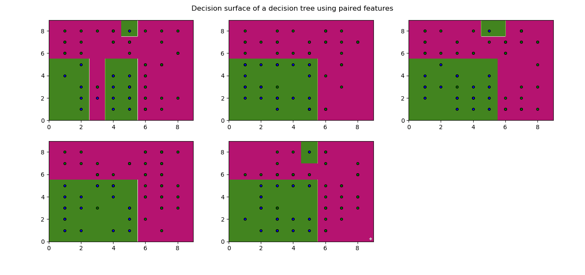
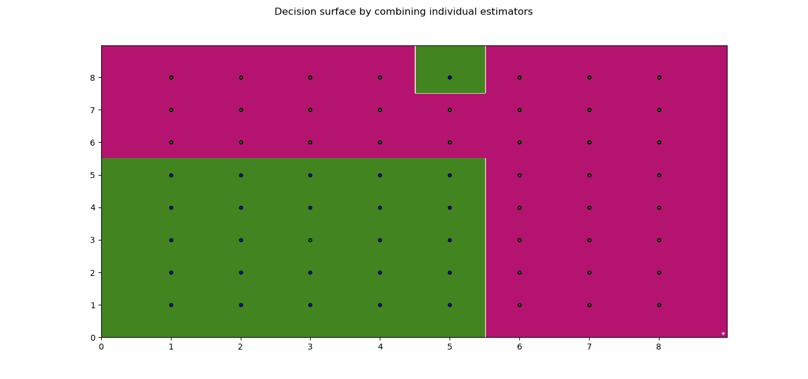

# ES654-2020 Assignment 2

*Rohit Shantaram Patil* - *17110126*
------

> Write the answers for the subjective questions here
## (a) Bagging on Random Inputs

Here are the results:

Criteria : information_gain
Accuracy:  0.8
Precision for 1  :  1.0
Recall for 1  :  0.4
Precision for 0  :  0.7692307692307693
Recall for 0  :  1

### Plots for the above case:

## (b) Reproducing Class slides

