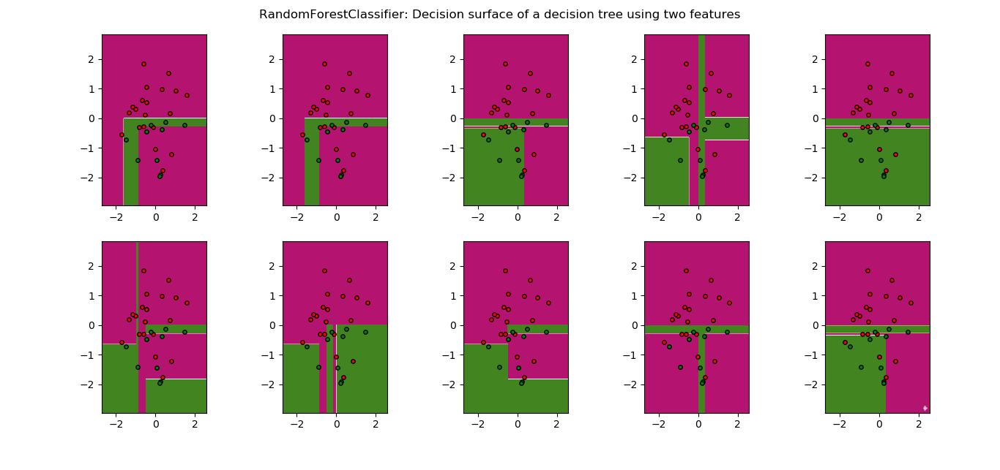
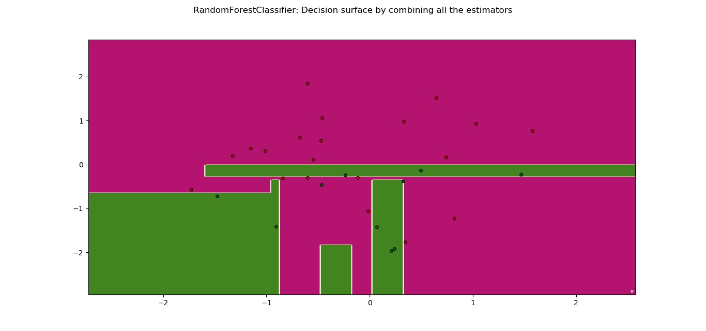
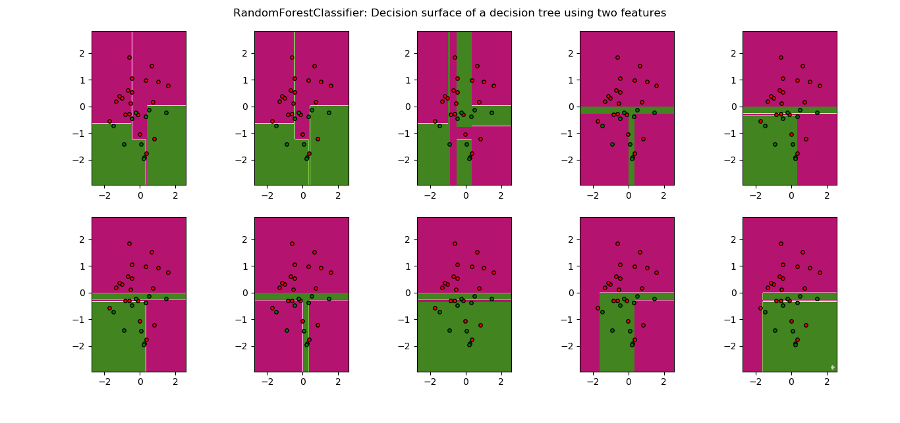
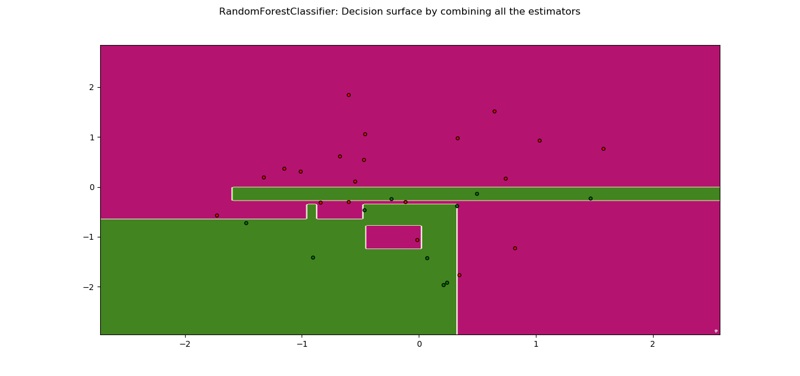
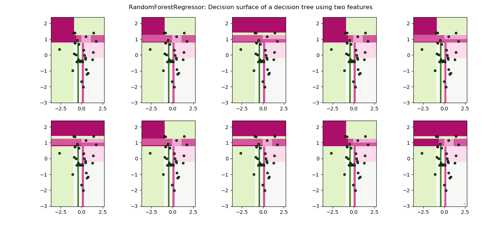
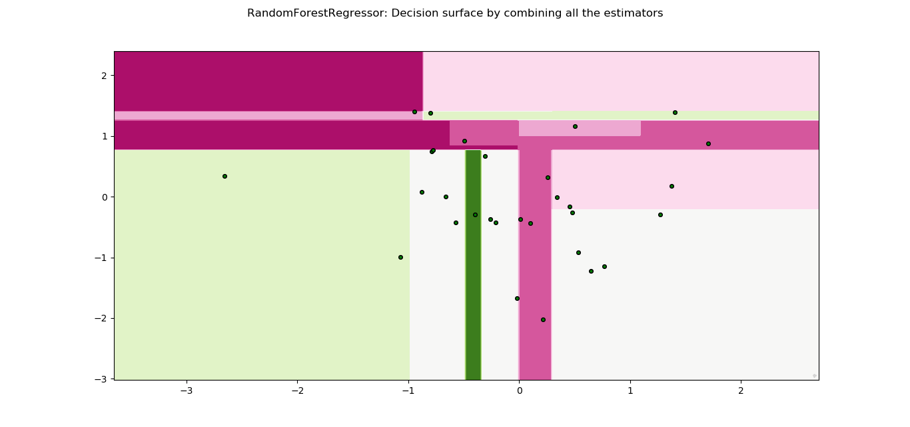
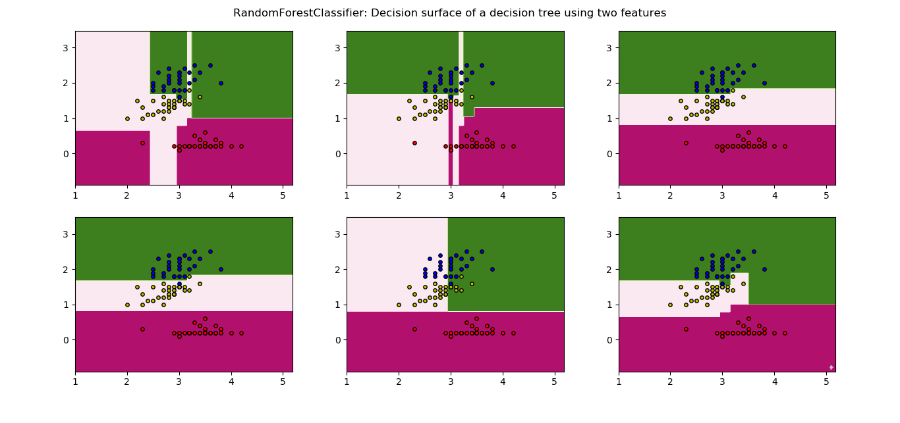
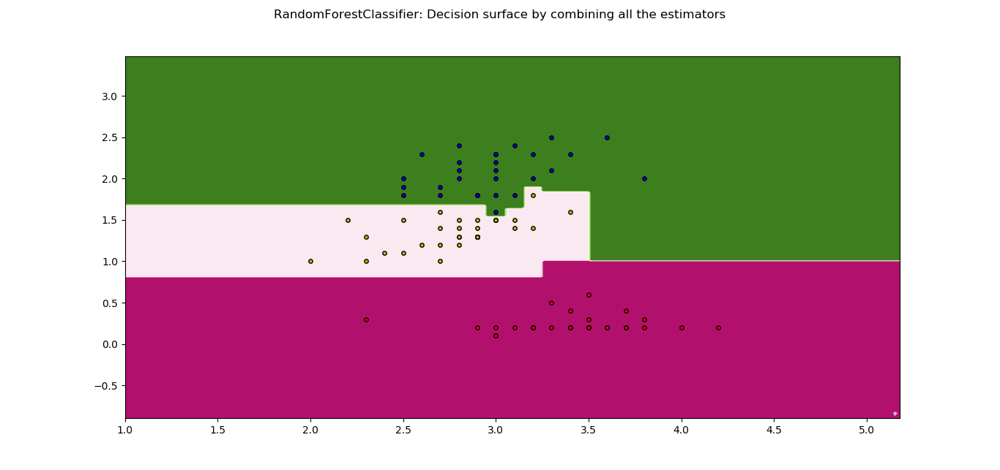

# ES654-2020 Assignment 2

*Rohit Shantaram Patil* - *17110126*
------

> Write the answers for the subjective questions here
## (a) Random forest on the given input

### Classifier:

Criteria : information_gain
Accuracy:  0.9666666666666667
Precision for 1  :  1.0
Recall for 1  :  0.9
Precision for 0  :  0.9523809523809523
Recall for 0  :  1

#### Plots

Criteria : gini_index
Accuracy:  1.0
Precision for 1  :  1.0
Recall for 1  :  1.0
Precision for 0  :  1.0
Recall for 0  :  1
Criteria : variance

#### Plots

### Regressor:
RMSE:  0.33935206238201143
MAE:  0.23577068287068434

#### Plots

## (b) Iris Dataset

0.9833333333333333
Precision for 0  :  1.0
Recall for  0 :  1
Precision for 2  :  1.0
Recall for  2 :  1
Precision for 1  :  0.9444444444444444
Recall for  1 :  1.0

#### Plots

