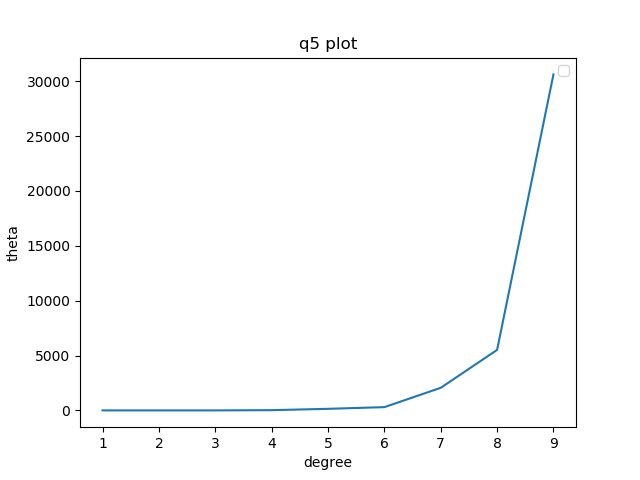

# ES654-2020 Assignment 3

*Rohit Shantaram Patil* - *17110126*

------

> Write the answers for the subjective questions here

### Normal equation implementation 
#

conclusion: magnitude of theta increases rapidly with respect to degree.
