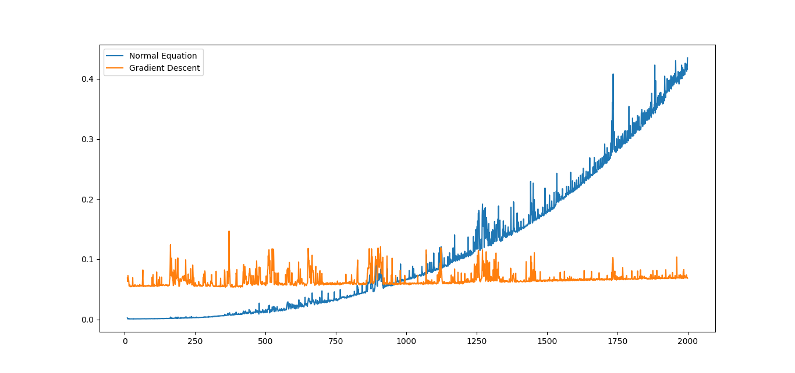
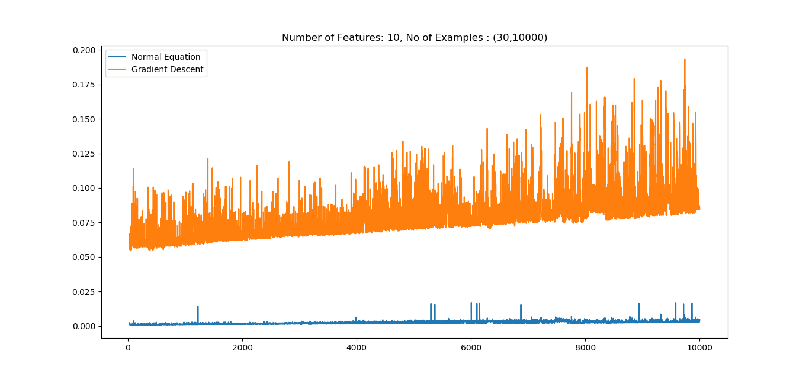

# ES654-2020 Assignment 3

*Rohit Shantaram Patil* - *17110126*

------

> Write the answers for the subjective questions here

# N Constant

# P Constant

time complexity for linear regression using normal equation is n^2p + P^3

If N is fixed, gradient descent algorithm takes linear time with respect to P, where as normal equation corresponds to cubic time complexity. We can observe the behaviour in the first plot. 